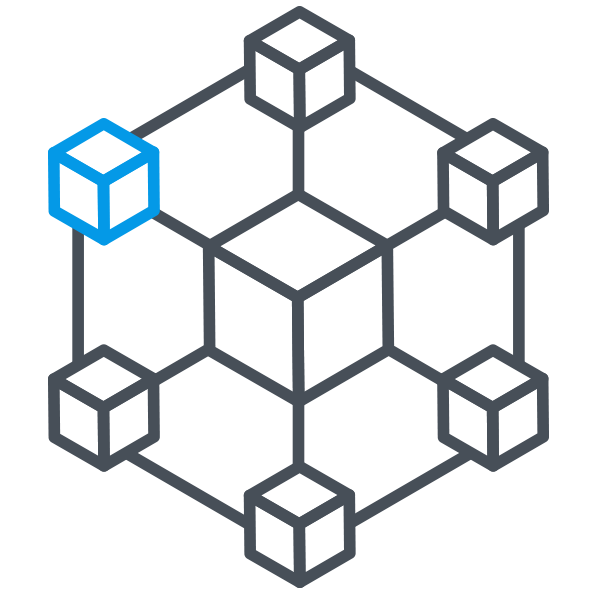

# Deep Blockchain Strategy for Secure IoT Networks

<!--
*** Thanks for checking out the Best-README-Template. If you have a suggestion
*** that would make this better, please fork the repo and create a pull request
*** or simply open an issue with the tag "enhancement".
*** Don't forget to give the project a star!
*** Thanks again! Now go create something AMAZING! :D
-->

<!-- PROJECT SHIELDS -->
<!--
*** I'm using markdown "reference style" links for readability.
*** Reference links are enclosed in brackets [ ] instead of parentheses ( ).
*** See the bottom of this document for the declaration of the reference variables
*** for contributors-url, forks-url, etc. This is an optional, concise syntax you may use.
*** https://www.markdownguide.org/basic-syntax/#reference-style-links

[![Contributors][contributors-shield]][contributors-url]
[![Forks][forks-shield]][forks-url]
[![Stargazers][stars-shield]][stars-url]
[![Issues][issues-shield]][issues-url]
[![MIT License][license-shield]][license-url]
[![LinkedIn][linkedin-shield]][linkedin-url]-->

<table align="center">
  <tr>
    <td>
      <b>Package</b>
    </td>
    <td>
      
      <!----->
      
      <!--<a href="https://pepy.tech/project/deepreg">
       --->
      </a>
    </td>
  </tr>
  <tr>
    <td>
      <b>Documentation</b>
    </td>
    <td>
      
    </td>
  </tr>
  <tr>
    <td>
      <b>Code</b>
    </td>
    <td>
      
      
      
      
      
      
    </td>
  </tr>
  <tr>
    <td>
      <b>Papers</b>
    </td>
    <td>
      <!--
      -->
        
    </td>
  </tr>
  <tr>
    <td>
      <b>Collaborates</b>
    </td>
    <td>
      
      
      
      
    </td>
  </tr>
</table>

<!-- PROJECT LOGO -->
 

  

<h3 align="center">A Deep Blockchain Strategy for Secure IoT Networks</h3>

  

    Highly distributed connected systems, such as the Internet of Things (IoT) have made their way across numerous fields of application. IoT systems present a method for the connection for various heterogeneous devices across the internet, facilitating the efficient distribution, collection and processing of system-related data. However, while system inter-connectivity has aided communication and augmented the effectiveness of integrated technology, it has also increased system vulnerability. To this end, researchers have proposed various security protocols and frameworks for IoT ecosystems. Yet while many suggested approaches augment system security, centralization remains an area of concern within IoT systems. Therefore, we propose the use of a decentralization scheme for IoT ecosystems, based on Blockchain technology. The proposed approach utilizes a fundamental public Blockchain with integrated deep learning for the purpose of anomaly detection within the peer-to-peer network.
     

  

# Coming Soon !

